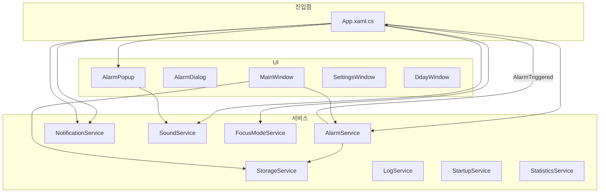
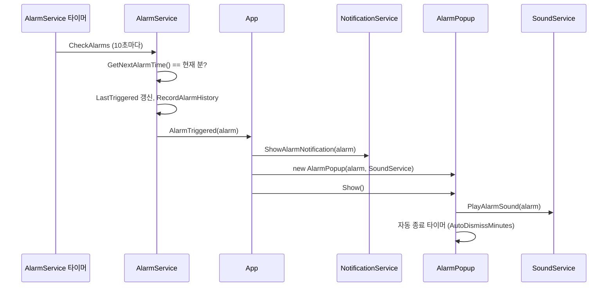

# DongNoti 코드베이스 분석

## 1. 프로젝트 개요

- **프레임워크**: WPF, .NET 8.0 (Windows 10.0.19041.0)
- **패키지**: `Hardcodet.NotifyIcon.Wpf`(트레이), `System.Drawing.Common`
- **버전**: 1.0.4.0
- **역할**: 알람·Dday 관리, 트레이 상주, 집중 모드, Toast/사운드 알림, 통계·로그·단축키

---

## 2. 아키텍처 개요

- **앱 진입점**: [App.xaml.cs](App.xaml.cs) — 단일 인스턴스(Mutex + Named Pipe), 서비스 생성·트레이·컨텍스트 메뉴, `AlarmTriggered` 구독 후 Toast + AlarmPopup + 사운드 처리.
- **메인 UI**: [MainWindow.xaml](MainWindow.xaml) / [MainWindow.xaml.cs](MainWindow.xaml.cs) — 알람/Dday 두 개의 DataGrid, 검색·필터·카테고리, 추가/수정/삭제, 집중 모드 버튼, 설정·Dday 창·통계·단축키.

---

## 3. 단일 인스턴스 처리

- **Mutex**: `DongNoti_SingleInstance_Mutex`로 첫 실행만 통과.
- **Named Pipe**: `DongNoti_SingleInstance_Pipe`. 두 번째 실행 시 `"ShowMainWindow"` 전송 후 종료.
- **기존 인스턴스**: Pipe 서버가 메시지 수신 시 UI 스레드에서 `ShowMainWindow()` 호출.

---

## 4. 모델 (Models)

| 파일 | 역할 |
|------|------|
| [Alarm.cs](Models/Alarm.cs) | 알람/Dday 공용 엔티티. `AlarmType`(Alarm/Dday), `RepeatType`(None/Daily/Weekly/Monthly), `Priority`, `Category`, `TargetDate`(Dday), `GetNextAlarmTime()`, `DdayDisplayString`, `IsDdayPassed` 등 |
| [AppSettings.cs](Models/AppSettings.cs) | 실행 시 옵션, 트레이/로그, 집중모드 상태·프리셋·놓친 알람, 알람 히스토리·카테고리, Dday 창 표시 여부 |
| [FocusModePreset.cs](Models/FocusModePreset.cs) | 집중 모드 시간 프리셋 (Id, DisplayName, Minutes) |
| [MissedAlarm.cs](Models/MissedAlarm.cs) | 집중 모드 중 놓친 알람 (AlarmId, Title, ScheduledTime, RepeatTypeString) |
| [AlarmHistory.cs](Models/AlarmHistory.cs) | 통계용 트리거 히스토리 (WasMissed 등) |
| [Priority.cs](Models/Priority.cs) | Low / Normal / High / Critical |

---

## 5. 서비스 (Services)

| 서비스 | 역할 |
|--------|------|
| [AlarmService.cs](Services/AlarmService.cs) | `StorageService.LoadAlarms()`로 목록 로드, 10초 타이머로 `CheckAlarms`. 활성 알람의 `GetNextAlarmTime()`과 현재 분이 일치하면 `LastTriggered` 갱신 후 `AlarmTriggered` 발생. 집중 모드 중에는 트리거 대신 `FocusModeService.RecordMissedAlarm` + 히스토리 기록. 일시 알람 트리거 후 삭제 및 저장·UI 갱신. |
| [StorageService.cs](Services/StorageService.cs) | `%LocalAppData%\DongNoti\` 아래 `alarms.json`, `settings.json` JSON 직렬화. 로드/저장 시 재시도(5회, 지수 백오프). Export/Import 알람 JSON. |
| [NotificationService.cs](Services/NotificationService.cs) | Windows Toast (ToastText02)로 알람 제목·시간 표시. |
| [SoundService.cs](Services/SoundService.cs) | 알람별 사운드 파일 또는 기본 시스템 사운드 반복 재생; 테스트 재생(3초 후 중지). |
| [FocusModeService.cs](Services/FocusModeService.cs) | 싱글톤. 시작/종료 시 설정 저장, 1분 타이머로 종료 시간 체크. `RecordMissedAlarm`, `GetMissedAlarms`, `GetPresets`. 종료 시 놓친 알람 있으면 `FocusModeEnded` 발생 → MissedAlarmsSummaryWindow 표시. |
| [LogService.cs](Services/LogService.cs) | 정적. 파일 로그 + 메모리 버퍼, 주기 Flush, UI 로그 콜백. |
| [StartupService.cs](Services/StartupService.cs) | 레지스트리 `Run` 키로 부팅 시 자동 실행 설정/해제. |
| [StatisticsService.cs](Services/StatisticsService.cs) | 설정의 `AlarmHistory` 기반 통계. |

---

## 6. 알람 트리거 ~ 팝업 흐름

- 집중 모드 활성 시: `CheckAlarms`에서 트리거 대신 `FocusModeService.RecordMissedAlarm` + 히스토리만 기록.

---

## 7. 데이터 소스 이중화 (AlarmService vs MainWindow)

- **AlarmService**: 메모리 `_alarms`를 파일에서 로드하고, 10초마다 체크·트리거·일시 알람 삭제 시 저장. `GetAlarms()`는 복사본 반환.
- **MainWindow**: `_alarms`를 가지고 있고, `LoadAlarms()` 시점에는 App.AlarmService가 있으면 그쪽 `GetAlarms()` 사용(파일 중복 로드 방지). 추가/수정/삭제 시 `SaveAlarms()` → `StorageService.SaveAlarms(_alarms)` 후 `App.RefreshAlarms(refreshMainWindow: false)`로 AlarmService와 트레이 메뉴 갱신.
- **동기화**: 저장 후 `RefreshAlarms(refreshMainWindow: false)` 또는 필요 시 `mainWindow.RefreshAlarmsList()`로 MainWindow가 AlarmService 기준 목록으로 다시 그리도록 되어 있음.

---

## 8. MainWindow UI 요약

- **알람 DataGrid**: 우선순위·카테고리·제목·날짜·시간·반복·활성 체크. 정렬(우선순위 내림, 날짜 오름차순), 검색·필터(알람만/Dday만/활성/비활성/반복 유형)·카테고리 필터. 행 스타일: 임시 알람, 우선순위, 이미 울린 일회성 알람 등.
- **Dday DataGrid**: Dday 문자열, 목표일, 우선순위·카테고리·제목·활성. 지난 Dday(`IsDdayPassed`) 제외.
- **상태바**: 다음 알람 정보(집중 모드 시 남은 시간), 총/활성 알람 수.
- **단축키**: Ctrl+N 추가, Ctrl+F 검색, Enter/F2 수정, Delete 삭제, Esc 선택 해제.
- **창 닫기**: 설정 `MinimizeToTray`이면 숨김, 아니면 `Application.Current.Shutdown()`.

---

## 9. 주요 뷰 (Views)

| 뷰 | 역할 |
|----|------|
| AlarmDialog | 알람/Dday 추가·수정. 타입(Alarm/Dday), 날짜·시간·반복·요일·사운드·자동 종료·카테고리·우선순위·메모(Dday). OK 시 Alarm 반환. |
| AlarmPopup | 트리거 시 표시. 제목·시간·반복, 사운드 재생, 자동 종료 타이머, "5분 후 다시 알림"(일시 알람 추가)·"닫기". 닫기/5분 후 시 `RecordAlarmHistory(wasMissed: false)`, 자동 종료 시 `wasMissed: true`. |
| FocusModeDialog | 집중 모드 시간 선택(프리셋 또는 분). |
| SettingsWindow | 시작 시 옵션, 트레이, 로그/UI 로그, 집중 모드 프리셋, 카테고리, 자동 실행(StartupService) 등. |
| DdayWindow | Dday 전용 플로팅 창. 표시 여부는 설정에 저장. |
| MissedAlarmsSummaryWindow | 집중 모드 종료 후 놓친 알람 요약. |
| StatisticsWindow | 알람 히스토리 기반 통계. |
| LogWindow | UI 로그 표시(LogService 콜백). |
| KeyboardShortcutsWindow | 단축키 안내. |

---

## 10. 파일 저장 위치

- **데이터**: `%LocalAppData%\DongNoti\alarms.json`, `settings.json`
- **로그**: `%LocalAppData%\DongNoti\Logs\` (일별 파일, 크래시 로그 포함)

---

## 11. 참고할 만한 구현 디테일

- **중복 트리거 방지**: `LastTriggered`와 현재 분 비교로 같은 분에 한 번만 트리거.
- **일시 알람**: Snooze 시 5분 후 알람을 `IsTemporary = true`로 추가; 트리거 후 AlarmService에서 목록에서 제거 후 저장·UI 갱신. 지나간 임시 알람은 `CleanupExpiredTemporaryAlarms`에서 제거.
- **초기 로드 시 저장 방지**: MainWindow `_isInitialLoad`, `_isLoading`으로 SaveAlarms 스킵.
- **알람 히스토리**: 트리거 시점에 `RecordAlarmHistory(alarm, wasMissed: true)`로 넣고, AlarmPopup에서 사용자가 닫기/5분 후 선택 시 같은 분 기록을 `wasMissed: false`로 업데이트.

이 분석을 바탕으로 기능 추가, 리팩터링, 버그 수정 시 위 경로와 서비스/이벤트 흐름을 참고하면 됩니다.
